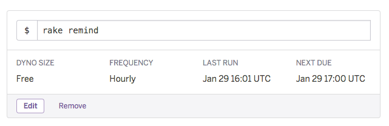

# ChatWorkMentionTask
https://chatwork-mention-task.herokuapp.com/

## Requirements
* Ruby
* PostgreSQL
* memcached
* ChatWork OAuth app

## Setup
```bash
./bin/setup

bundle exec foreman s
```

# Heroku deploy
[](https://heroku.com/deploy?template=https://github.com/sue445/chatwork_mention_task)

Register `rake remind` to [Heroku Scheduler](https://addons.heroku.com/scheduler)


