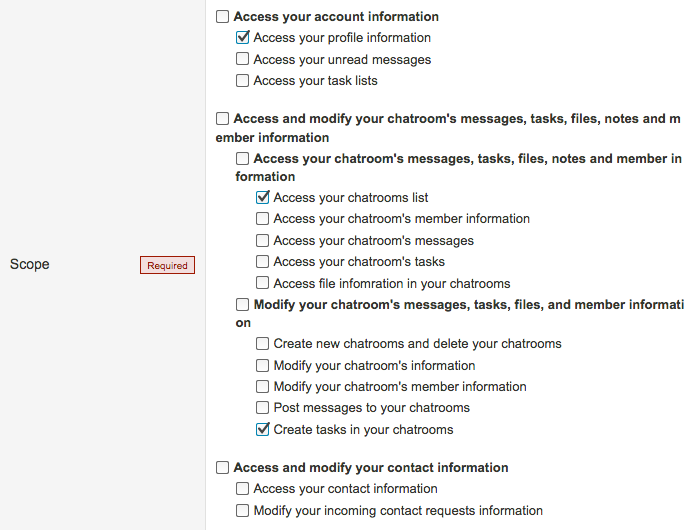

# NO LONGER MAINTAINED
Heroku recently announced the end of its free plan offerings.

https://blog.heroku.com/next-chapter

This app is running on Heroku Free dyno, but I decided to terminate this app after Heroku's announcement :sob:

* I have no plans to migrate this app from Heroku to another platform. This app is OSS so you can fork it and make it work on another platform
* This app will continue to run until Heroku stops this.  (Probably November 28, 2022 or later)

Thank you.

# ChatWorkMentionTask
ChatWorkMentionTask can automatically task the mentions that came to you, easily look back on it later.

https://chatwork-mention-task.herokuapp.com/

[](https://circleci.com/gh/sue445/chatwork_mention_task)
[](https://coveralls.io/github/sue445/chatwork_mention_task?branch=master)
[](https://codeclimate.com/github/sue445/chatwork_mention_task/maintainability)

## Requirements
* Ruby
* PostgreSQL
* memcached
* ChatWork OAuth app

## Register ChatWork OAuth client
If you are developing or deploying ChatWorkMentionTask, you need to register the ChatWork OAuth client

* ChatWork.com: https://www.chatwork.com/service/packages/chatwork/subpackages/oauth/client_list.php
* KDDI ChatWork: https://kcw.kddi.ne.jp/service/packages/chatwork/subpackages/oauth/client_list.php

parameters

* Redirect URI: `https://<APP-HOST>/auth/chatwork/callback`
* Scope: followings
  * Access your profile information
  * Access your chatrooms list
  * Create tasks in your chatrooms



## Development
```bash
./bin/setup
vi .env

bundle exec foreman s
```

Open https://localhost:9292/

## Heroku deploy
[](https://heroku.com/deploy)
